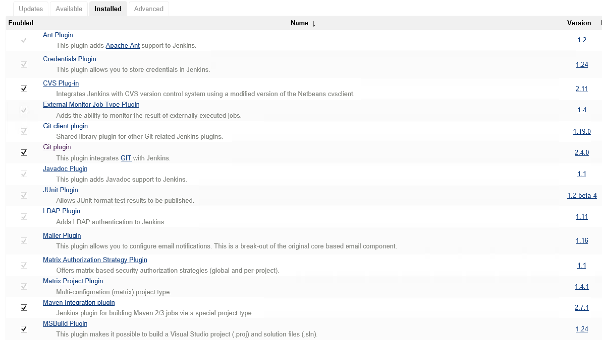
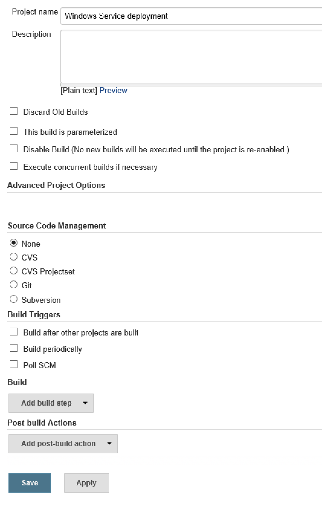
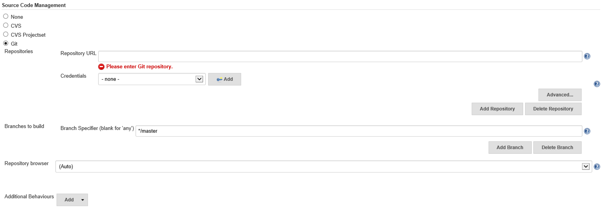
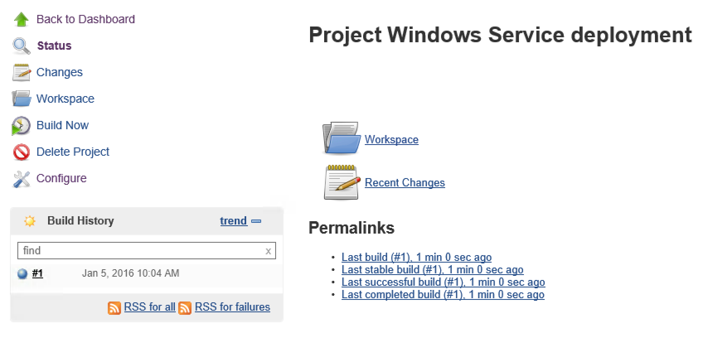
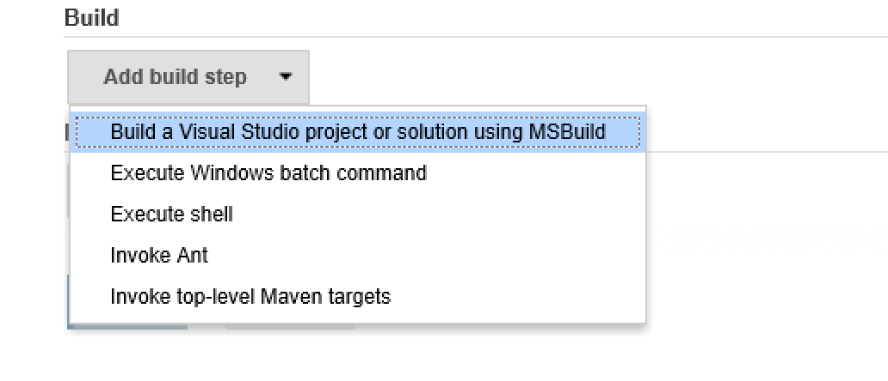
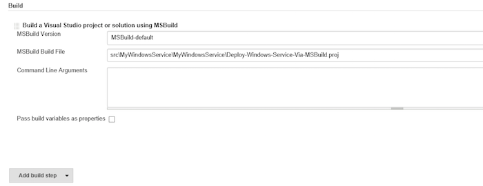
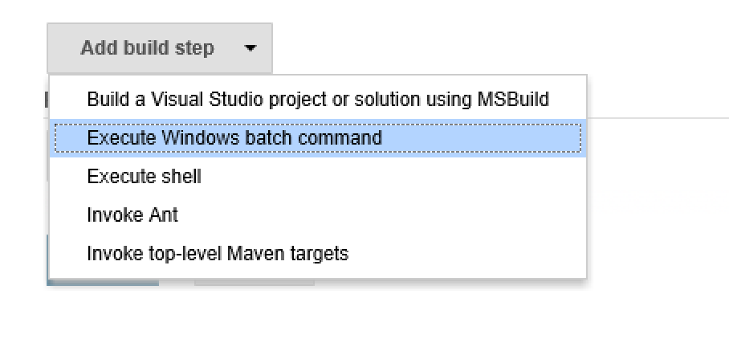
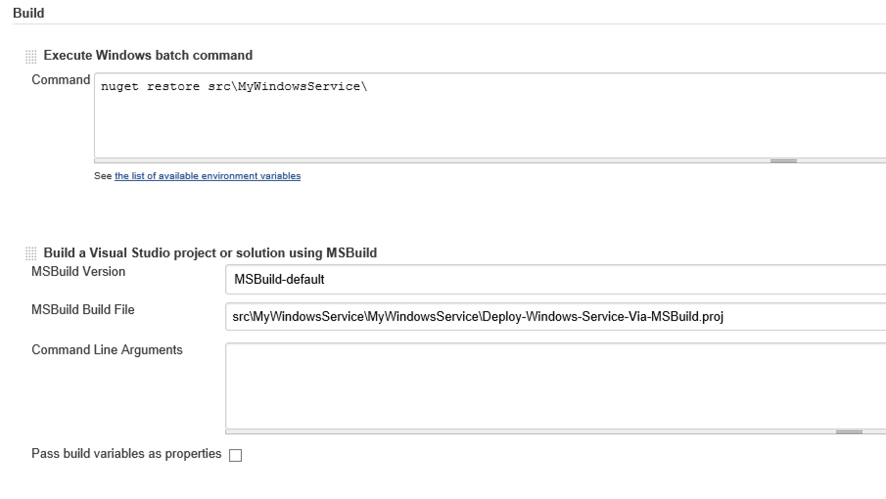
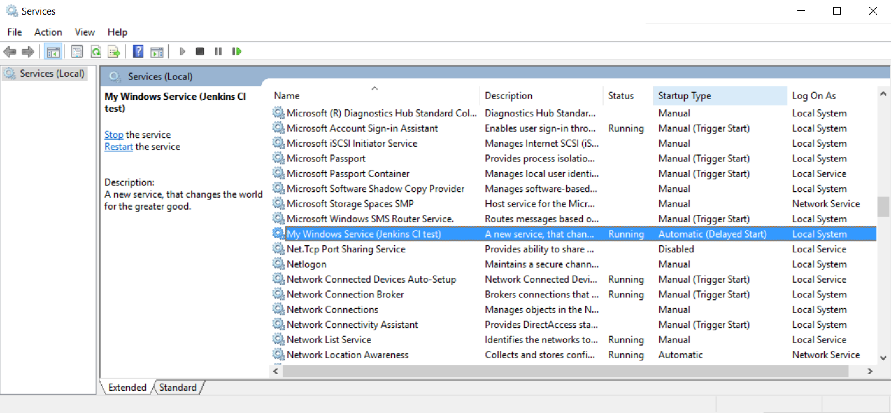

#Jenkins-CI-Template
This repo is intended to make it easy to set up Jenkins to build and deploy a Windows Service. 

This Windows Service depends on NuGet packages and some custom build, deploy and install scripts. 

###Credits:
The Windows Service install scripts were created by:

[mrchief](http://mrchief.calepin.co/deploying-windows-service-via-msbuild)


#Continuous Deployment with Jenkins & .NET

// Comment from Matthew: could we shorten this section? I assume most .NET devs will already know about continuous deployment.

As a .NET developer you are probably using Visual Studio. Hitting F5 in Visual Studio compiles the source code and starts the debugger. If you are like me you will hit F5 many times during development and bug hunting.

But what happens when the code is ready for prime time? Deployment happens!

When I needed to publish an application I often choose the laziest option: manually copying the executable to the destination, manually installing and manually starting the application.

It’s “fun” the first few times, but in the end it gets really difficult; particularly keeping track of changes and manual updates/deployments. To be honest, this manual approach does not scale very well: it takes unnecessary time and it’s prone to human errors in the deployment process. 

A more mature option would be to have an automated infrastructure to handle deployment. Such infrastructure is often referred to as Continuous Integration/ Continuous Deployment. 

Using Continuous Integration/Continuous Deployment, enables a workflow like this:

 * Code, build and test locally on your dev. box (as usual) 
 * Check source code in to a development branch in your favourite Source Control Management System.
* Optional code review by team members.
* Merge your changes to the main (release) branch.
* The CI Server will detect the changes to the main branch and download, compile and deploy/install your application on the release server. 

There are no manual steps: it’s all scripted and automatic.

##Continuous Deployment
You can choose from a number of Continuous Integration/Deployment (CI) tools, each with its own caveats. In my set-up I need a CI Server that understands the components in my application.

So let’s take a closer look at my application architecture and components:

* **Platform**: .NET 4.5.2
* **IDE**: Visual Studio 2015 (MSBuild files)
* **Application type**: Windows Service
* **NuGet**: Package Manager used for all references.
* **Source Control**: Git (github.com)

The CI Server should be able to understand all components mentioned above and (as I’m lazy) it should be really easy to maintain and set up.

I did a bit of research and from other people's experiences and blog posts I found that Jenkins seemed to suit my needs best.

###Jenkins
Jenkins is a build server with a plugin architecture that allows the community to extend what Jenkins can “understand”. This architecture makes it easy to extend Jenkins to support MSBuild files, Git version control etc.

[Meet Jenkins](https://wiki.jenkins-ci.org/display/JENKINS/Meet+Jenkins)

###Set-up
Jenkins is installed on a build server. In my set-up the build server is the same as the release server, but this can be configured differently. 

*Download and install* Jenkins for your platform here: https://jenkins-ci.org/

After installation Jenkins is available on its default port: [http://localhost:8080/](http://localhost:8080/)

###Configure Jenkins
Jenkins has plugins for understanding Git repositories, MSBuild files and various other technologies. In the current set-up we only need to extend Jenkins with those two plugins.

####Install the Git Plugin for Jenkins:
1. Open Jenkins, [http://localhost:8080/](http://localhost:8080/)
2. Navigate to "Manage Jenkins"
3. Navigate to "Manage Plugins"

   *Direct link: [http://localhost:8080/pluginManager](http://localhost:8080/pluginManager)*
   
4. Use the "filter" box to search for "Git plugin" and install the plugin.


####Install the MSBuild Plugin for Jenkins:
1. Open Jenkins, [http://localhost:8080/](http://localhost:8080/)
2. Navigate to "Manage Jenkins"
3. Navigate to "Manage Plugins"

   *Direct link: [http://localhost:8080/pluginManager](http://localhost:8080/pluginManager)*
   
4. Use the "filter" box to search for "MSBUILD plugin" and install the plugin.

 

 Jenkins now understands MSBuild files and Git source control, but we still need to configure the MSBuild Plugin with a path to the msbuild.exe we would like to use.

####MSBuild configuration
When the MSBuild plugin was installed it added its own configuration options to the Jenkins global configuration page.

1. Navigate to [http://localhost:8080/](http://localhost:8080/)
2. Click "Manage Jenkins"
3. Click "Configure System"
4. Scroll down the list until you find "MSBuild"
5. Click the "MSBuild installations..." button
6. Click “Add MSBuild”
7. Give the new MSBuild configuration a name like "MSBuild-default".
8. In the path field, insert the fully qualified path to "msbuild.exe"

 On my server the path is: `C:\Program Files (x86)\MSBuild\14.0\Bin\msbuild.exe`, but this can be different on your system. 
 
 Read below for more information about MSBuild and how to install it.
 
9. Click save.


 **MSBuild:** 
*MSBuild is installed with Visual Studio, it’s the build system that Visual Studio uses when you select "build" or hit "F5".* 

 *It’s not always feasible or even possible to install Visual Studio on your build machine. This could be due to license and security issues etc.* 

 *To accommodate this Microsoft has released a separate package called: 
"Microsoft Build Tools 2015" that contains all you need for for using MSBuild.*

 *Direct download: [https://www.microsoft.com/en-us/download/details.aspx?id=48159](https://www.microsoft.com/en-us/download/details.aspx?id=48159)* 

 *After successful installation you have MSBuild available on the build server and with that you get the path value for step 8, above.*

With this step done Jenkins is ready to build and deploy with MSBuild and Git.
 
###Create a new Jenkins build project
It’s now time to point Jenkins to the source code and start building.

1. Open Jenkins, [http://localhost:8080/](http://localhost:8080/) 
2. Select "new". 
 
 Direct link [http://localhost:8080/view/All/newJob](http://localhost:8080/view/All/newJob) 
 
3. Give the project a name "Windows Service Deployment" or something you can remember.
4. Select “Freestyle project”.
5. Select “Ok”.
 
 

6. Next, expand the “Source Code Management” region by selecting “Git”.

 
 

7. Complete the Git configuration by filling in the blanks with a URL to your repository and optionally credentials (if needed). 
 
 Jenkins can also work with branches. In this set-up I will leave the branch as the default (Master) but you can select whatever fits your needs.

 If you don't already have a Git repository ready for testing, you can use the pre-cooked repository here: 

 [https://github.com/martinesmann/jenkins-ci-template](https://github.com/martinesmann/jenkins-ci-template) 

 The source code contains a few more files than your average "Hello Windows Service" solution. I will explain relevant parts later on as they are used. For now we will just treat this as a "Hello World" solution.

8. If you haven’t done so already, click “Save” to persist your changes and navigate back to the main "Project" page.

####Testing the Git configuration
Now we can test if the Git Source Management tab has been configured correctly and that we can clone the source code. 

We are not yet building anything, only cloning the source. Building will come in a moment. First, let's make sure Jenkins can clone the source from the repository.

1. Navigate to the "Project" page
2. Click the “Build Now” to start a "Build".

 


3. In the "Build History" region you should now see a build in progress with the name "#1".
4.  If every completes as expected “SUCCESS” then the bubble maker stays blue, if not it goes red.
5. To see the build details, click the build number "#1"
6. Then click "Console Output".
 You should see something similar to what I have here:   
 
 ```
Started by user anonymous
Building in workspace C:\Program Files (x86)\Jenkins\jobs\Windows Service deployment\workspace
Cloning the remote Git repository
Cloning repository https://github.com/martinesmann/jenkins-ci-template
 > git.exe init C:\Program Files (x86)\Jenkins\jobs\Windows Service deployment\workspace # timeout=10
Fetching upstream changes from https://github.com/martinesmann/jenkins-ci-template
 > git.exe --version # timeout=10
 > git.exe -c core.askpass=true fetch --tags --progress https://github.com/martinesmann/jenkins-ci-template +refs/heads/*:refs/remotes/origin/*
 > git.exe config remote.origin.url https://github.com/martinesmann/jenkins-ci-template # timeout=10
 > git.exe config --add remote.origin.fetch +refs/heads/*:refs/remotes/origin/* # timeout=10
 > git.exe config remote.origin.url https://github.com/martinesmann/jenkins-ci-template # timeout=10
Fetching upstream changes from https://github.com/martinesmann/jenkins-ci-template
 > git.exe -c core.askpass=true fetch --tags --progress https://github.com/martinesmann/jenkins-ci-template +refs/heads/*:refs/remotes/origin/*
 > git.exe rev-parse "refs/remotes/origin/master^{commit}" # timeout=10
 > git.exe rev-parse "refs/remotes/origin/origin/master^{commit}" # timeout=10
Checking out Revision db11bee4586694774f21e9f38b57af8535c88e1e (refs/remotes/origin/master)
 > git.exe config core.sparsecheckout # timeout=10
 > git.exe checkout -f db11bee4586694774f21e9f38b57af8535c88e1e
First time build. Skipping changelog.
Finished: SUCCESS
 ```

 *What’s important to note here is the **path** to the "workspace" as this is where the source code is downloaded to and built from. This knowledge can be very helpful when debugging the CI setup.*


####Building the source
The next step is to compile and build the source code. 

1. Navigate to the "project" page 
2. Select “Configure” 
3. Find the "Add build step"

  

4. Select the "Build a Visual Studio project or solution using MSBuild".
 
 We need to configure a few values here:
 
 1. First, select the MSBuild version (we configured this in a previous step).
 2. Then give the path to the *.sln or *.proj file for your project. 
 
       *For the pre-cooked repository the path is: 
       `src\MyWindowsService\MyWindowsService\Deploy-Windows-Service-Via-MSBuild.proj`*

      **Please note**: *We are not pointing to the solution file, rather we are pointing to a custom MSBuild file that is in the project. This MSBuild file is handling all steps involved with compiling and deploying the Windows Service.*
      
      *You can read more about this MSBuild file from the author's own blog, here:
[http://mrchief.calepin.co/deploying-windows-service-via-msbuild](http://mrchief.calepin.co/deploying-windows-service-via-msbuild)*

     If you are using the pre-cooked repository, your setup should look like this:

     

  3. Click save

####NuGet package restore
If we were to build the project right now it would fail due to missing NuGet packages. Therefore we need to restore the NuGet packages before attempting to build the source. 

nuget.exe makes this task very easy, we simply need to fire this command on the solution file:

`nuget restore "path to *.sln" file`


No surprise Jenkins can handle multiple build steps, so let's add a build step to enable NuGet restore.

1. Navigate to the "project" page. 
2. Select "Configure".
3. Find the "Add build step".
4. Click "Add build step".

 
 
5. Select "Execute Windows batch command".
6. Re-arrange the build order by dragging the new build step to the top.
 
 
 
7. In the Command field insert: 

 `nuget restore src\MyWindowsService\`
 
8. Click "Save". 

We are now ready to build the project!

####The final test! Primetime!

1. Navigate to the project page
2. Click the "Build now" link
3. Wait for the build to complete
4. Open "Windows Explorer" and navigate to `C:\`
5. Confirm that the file “MyWindowsService.log” exists

 

6. Open the file and read the log content. 

	This file was create by our newly installed Windows Service!
7. Check that the Service is installed and running:

 1. On Windows open "Services" management window
 2. Scroll down to you find the service "My Windows Service (...)"
  
     

*Congratulations!* You have now successfully configured Jenkins to download, compile and deploy a .NET Windows Service! Automation ROCKS!
 
###The source code:
So far we have not given much attention to the source code, but let’s take a moment to walk through the repository content and structure. 

If you navigate to the repository root at: 

[https://github.com/martinesmann/jenkins-ci-template](https://github.com/martinesmann/jenkins-ci-template) 

you will find all the usual files as README etc. but also a file called `nuget.exe`.

`nuget.exe` is the executable used to restore the solution's NuGet package dependencies. You could argue whether or not it’s good practice to have binary files in your source control, but in this case it’s a required dependency for the build system and therefore I have included it.

I have placed `nuget.exe` in the root, to keep it separated from the actual source code and make it easy to find when setting up the build in Jenkins.

If we navigate deeper into the repository to [src/MyWindowsService/MyWindowsService/](https://github.com/martinesmann/jenkins-ci-template/tree/master/src/MyWindowsService/MyWindowsService) we find four files that do all the hard lifting of compiling and installing the Windows Service. 

The main entry point file is [Deploy-Windows-Service-Via-MSBuild.proj](https://github.com/martinesmann/jenkins-ci-template/blob/master/src/MyWindowsService/MyWindowsService/MyWindowsService.csproj) it’s a MSBuild file constructed to, not only, compile the source code; but also: stop, uninstall and start the Windows Service application. This is achieved by calling the three batch files as needed: [safeServiceDelete.bat](https://github.com/martinesmann/jenkins-ci-template/blob/master/src/MyWindowsService/MyWindowsService/safeServiceDelete.bat), [safeServiceStart.bat](https://github.com/martinesmann/jenkins-ci-template/blob/master/src/MyWindowsService/MyWindowsService/safeServiceStart.bat) and [safeServiceStop.bat](https://github.com/martinesmann/jenkins-ci-template/blob/master/src/MyWindowsService/MyWindowsService/safeServiceStop.bat).

It’s out of the scope for this blog post to explain in detail what each of the four files do, but if you take a look at the files individually I’m sure you will get a very good understanding of their inner workings and how they collaborate. 

The Windows Service source code can be viewed and edited in Visual Studio to fit your specific needs. The sample source given in the repository is very simple and only writes a few entries to a text file (log file) and also "upserts" a document to Couchbase Server:

[Service1.cs](https://github.com/martinesmann/jenkins-ci-template/blob/master/src/MyWindowsService/MyWindowsService/Service1.cs)

```C#
using System;
using System.Collections.Generic;
using System.IO;
using System.ServiceProcess;
using Couchbase;
using Couchbase.Configuration.Client;

namespace MyWindowsService
{
    public partial class Service1 : ServiceBase
    {
        bool firstRun;
        public Service1()
        {
            InitializeComponent();
        }

        protected override void OnStart(string[] args)
        {
            firstRun = true;

            Log(
                LogToCouchbase(new List<string> { "OnStart:", DateTime.Now.ToString() })
            );
        }

        protected override void OnStop()
        {
            Log(
                 LogToCouchbase(new List<string> { "OnStop:", DateTime.Now.ToString() })
             );
        }

        private List<string> Log(List<string> lines)
        {
            try
            {
                File.AppendAllLines("c:\\MyWindowsService.log.txt", lines);
            }
            catch (Exception ex)
            {
                lines.AddRange(
                    new[] {
                        "Excpetion:",
                        ex.Message,
                        ex.StackTrace
                    });
            }

            return lines;
        }

        private List<string> LogToCouchbase(List<string> lines)
        {
            try
            {
                if (firstRun)
                {
                    var config = new ClientConfiguration
                    {
                        Servers = new List<Uri> { new Uri("http://10.0.0.4:8091") }
                    };

                    ClusterHelper.Initialize(config);

                    firstRun = false;
                }

                // this will overwrite any old log lines!
                var result =
                    ClusterHelper
                    .GetBucket("default")
                    .Upsert<dynamic>(
                        "MyWindowsService.log.txt",
                        new
                        {
                            id = "MyWindowsService.log.txt",
                            log = string.Join("\n", lines)
                        }
                    );

                lines.AddRange(
                new[] {
                        "Couchbase result: ",
                        result.Success.ToString(),
                        "Document Key: ",
                        "MyWindowsService.log.txt"
                });
            }
            catch (Exception ex)
            {
                lines.AddRange(
                new[] {
                        "Excpetion:",
                        ex.Message,
                        ex.StackTrace
                });
            }

            return lines;
        }
    }
}
```

If you are new to Couchbase I would suggest taking a look at our .NET tutorial here:

[try-cb-dotnet](https://github.com/couchbaselabs/try-cb-dotnet).


###Create your own
The easiest way to create your own self deployable Windows Service using Jenkins would most likely be to clone this repository and change the service code in Visual Studio to your needs.

Thanks for reading!


